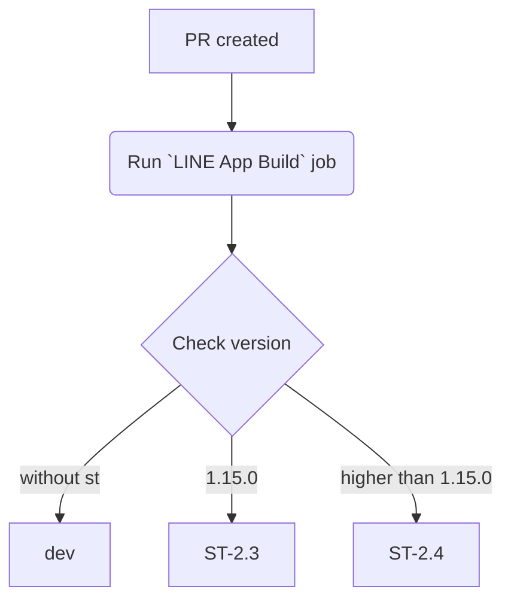

# algorithm

```mermaid
graph TD
    A[PR created] --> B(Run `LINE App Build` job)
    B --> C{Check version}
    C -->|without st| D[dev]
    C -->|1.15.0| E[ST-2.3]
    C -->|higher than 1.15.0| F[ST-2.4]
```
